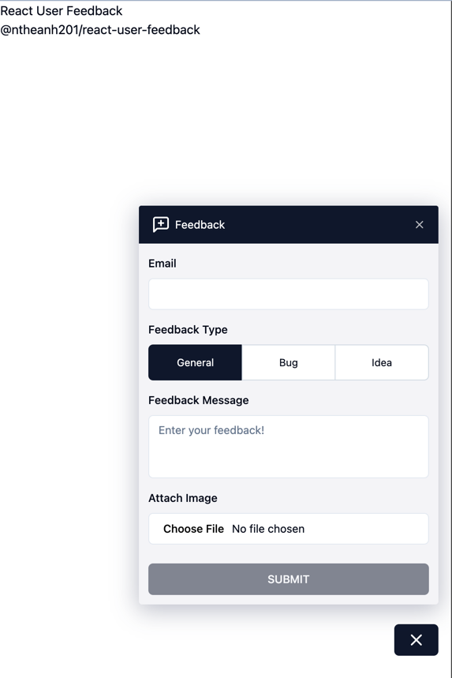

<h1 align="center">React User Feedback</h1>

<div align="center">
  <p>
    Collect user's feedback for React using TailwindCSS, shadcn/ui, Storybook, Parcel, Rollup
  </p>
  
</div>

<p align="center">
  
</p>

## The Setup

- [React v18](https://react.dev/)
- [TypeScript](https://www.typescriptlang.org/)
- Style: [Tailwind CSS](https://tailwindcss.com/)
- UI library: [shadcn/ui](https://ui.shadcn.com/)
- UI development with [Storybook](https://storybook.js.org/)
- Linting with [ESLint](https://eslint.org/) and code formatting with [Prettier](https://prettier.io/)
- Conventional commit messages with [Commitlint](https://commitlint.js.org/)
- Build the library with [Rollup](https://rollupjs.org/)
- Automated release with [changesets](https://github.com/changesets/changesets/)

## Getting Started

### Install with `yarn` or `npm` or `pnpm`:

`pnpm add @ntheanh201/react-user-feedback`

### Usage

```typescript
import UserFeedback from '@ntheanh201/react-user-feedback';

<UserFeedback
	disabled={false}
	allowImage={true}
	feedbackTypes={[
		{ value: 'general', label: 'General' },
		{ value: 'bug', label: 'Bug' },
		{ value: 'idea', label: 'Idea' },
	]}
	onSubmit={(values, onError) => {
		console.log('values: ', values);
	}}
/>;
```

## Props

| prop          | description                                    | type                | required? | default                                                                                                 |
| ------------- | ---------------------------------------------- | ------------------- | --------- | ------------------------------------------------------------------------------------------------------- |
| disabled      | Hide user's feedback                           | boolean             | no        | false                                                                                                   |
| allowImage    | Allow upload image                             | boolean             | no        | false                                                                                                   |
| feedbackTypes | Custom feedback types                          | array<label, value> | no        | [{ value: 'general', label:'General' },{ value: 'bug', label: 'Bug' },{ value: 'idea', label: 'Idea' }] |
| timeout       | Set timeout for the button's label when submit | number              | no        | 3000                                                                                                    |
| onSubmit      | Submit function                                | function            | yes       |

## Contributing

To run this module locally:

1. Clone the repo:

   `git clone https://github.com/ntheanh201/react-user-feedback`

2. Install the node modules

   `pnpm i`

3. Run

- Run the demo

  `pnpm start`

- Run the storybook

  `pnpm storybook`

This will bundle the client with `parcel` and listening on [http://localhost:1234](http://localhost:1234)

Open [http://localhost:1234](http://localhost:1234) to view the demo
